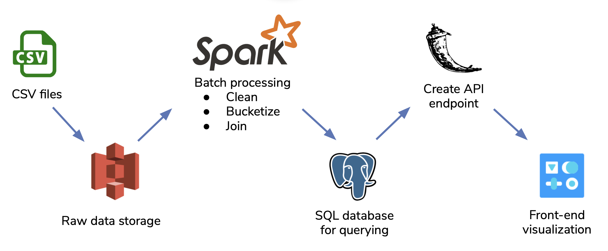
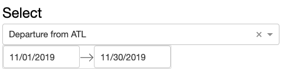
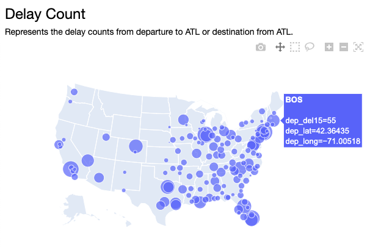
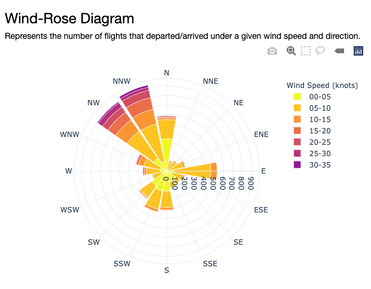
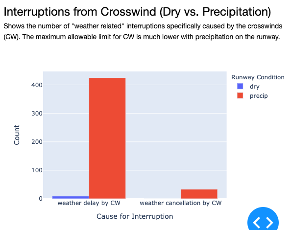

# Delay On The Runway: Tracking Flight Delays from Takeoff and Landing 

## Table of Contents
- [Introduction](#introduction)
- [Dataset](#dataset)
- [Data Pipeline](#data-pipeline)
- [Data Processing](#data-processing)
- [Data Storage](#data-storage)
- [Query and Data Visualization](#query-data-visualization)
  * [Delayed Airport Count](#delayed-airport-count)
  * [Wind-rose](#wind-rose)
  * [Crosswind Interruptions from Precipitation](#crosswind-interruptions-from-precipitation)

## Introduction
Severe crosswinds on airport runways pose significant delay times for aircrafts looking to takeoff or land. Hartsfield Jackson Atlanta International Airport (ATL) is the busiest airport in the world that serves over 110 million passengers and hosts nearly a million aircraft operations each year. Despite this, it consists of 5 runways that are all parallel to one another and provides no alternative paths for alternate takeoff or landing under crosswind conditions.

The vision of this project is to provide a database that characterizes the flight delays caused by crosswind. This will help enable the pilots and airport runway operations to better prepare for future takeoff and landing logistics based on detailed historical crosswind details.

## Dataset
Domestic flights within the US and the weather data from ATL station between June 2003 to March 2020 was used. They were retrieved as 46GB of CSV files and stored into AWS S3 Bucket.

### Source:
* [Historical flight data](https://transtats.bts.gov/DL_SelectFields.asp?Table_ID=236&DB_Short_Name=On-Time): Bureau of Transportation Statistics (BTS)
* [Historical weather data](https://download.synopticdata.com): National Oceanic and Atmospheric Administration (NOAA)
* [Longitude & latitude of airports](https://gist.github.com/mj1856/6d219c48697c550c2476)
* [Airport timezones](https://gist.github.com/mj1856/6d219c48697c550c2476)

## Data Pipeline
This data pipeline consists of the following technologies: S3 storage where the raw data is stored, Spark for batch processing and stored as a PostgreSQL database, where the queries can be requested through the API calls using Flask and visualized through Dash.

## Data Processing (Spark)
PySpark DataFrames were used for data transformation of flight and weather data. Below is a list of a few data processing steps.

Flight Data:
* Determining whether the flight was departure or arrival w.r.t to ATL airport
* Join tables to provide longitude and latitude coordinates and the timezone that it belongs to based on each airport IATA code
* Formatting the string of date and time into datetime while converting the individual time zones of each airport to a common timezone
* Round the time to the nearest 5 minutes to align with the intervals of the weather data

Weather Data:
* Convert weather station’s location to ATL’s timezone
* Bucketized the wind speed and identify if it is a crosswind based on the wind direction
* Binarize precipitation and check if crosswind limit is exceeded
* Join with the flight dataframe based on IATA code

## Data Storage (PostgreSQL)
The transformed data that combined the historical flight and weather data is written to PosgreSQL database. Given the large volume of processed data, the database was indexed by the dep_time and arr_time to help speed up the querying process for the range of dates.

## Query and Data Visualization (Flask, Dash)
Queries are requested through API endpoints using Flask. The user is able to select a range or dates and specify departure/arrival to visualize various flight delayed information using Dash.

### Delayed Airport Count
The bubble map depicts the amount of delays of a given airport within a date range. If departure is selected, it shows the destination airport from ATL airport which is departed from. Similarly, selecting arrival will show the originating airport to ATL airport. It is noted that delays are considered any arrivals or departures that were postponed by more than 15 minutes.

### Wind-rose
The windrose diagram represents the number of flight delays and the wind condition at the expected departure or arrival time. The bucketized wind speed (knots) and its cardinal direction may be used to assess severe crosswind conditions. It is noted that the runways on the ATL airport spans along East and West.

### Crosswind Interruptions from Precipitation
The bar-chart compares interruptions (delays and cancellations) that were classified as weather-related, and identifies if it was likely due to crosswind. The maximum crosswind limit is often much lower if there is precipitation, as opposed to dry runway conditions. 

