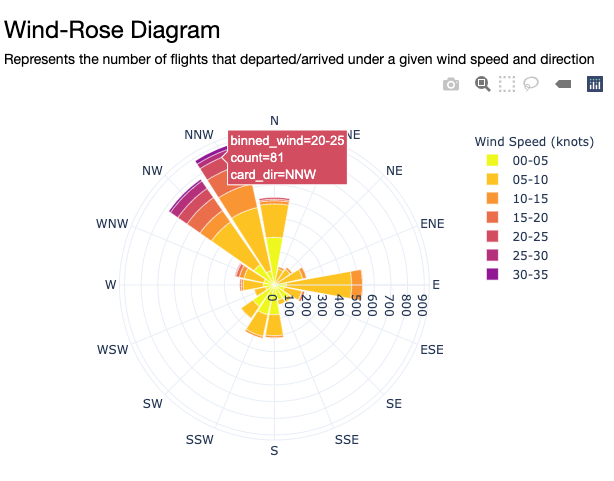
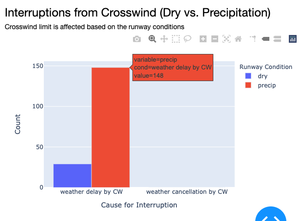

# Delay On The Runway: Tracking Flight Delays from Takeoff and Landing 

## Table of Contents
1. [Introduction](#introduction)
1. [Dataset](#dataset)
1. [Data Pipeline](#data-pipeline)
1. [Future Work](#future-work)
1. [Contact Information](#contact-information)

## Introduction
Severe crosswinds on airport runways pose significant delay times for aircrafts looking to takeoff or land. Hartsfield Jackson Atlanta International Airport (ATL) is the busiest airport in the world that serves over 110 million passengers and hosts nearly a million aircraft operations each year. Despite this, it consists of 5 runways that are all parallel to one another and provides no alternative paths for alternate takeoff or landing under crosswind conditions.

The vision of this project is to provide a database that characterizes the flight delays caused by crosswind. This will help enable the pilots and airport runway operations to better prepare for future takeoff and landing logistics based on detailed historical crosswind details.

## Dataset
Domestic flights within the US and the weather data from ATL station between June 2003 to March 2020 was used. They were retrieved as 46GB of CSV files and stored into AWS S3 Bucket.

### Source:
* Historical flight data: Bureau of Transportation Statistics (BTS)
* Historical weather data: National Oceanic and Atmospheric Administration (NOAA)
* Longitude & latitude of airports
* Airport timezones

## Data Pipeline
This data pipeline consists of the following technologies: S3 storage where the raw data is stored, Spark for batch processing and stored as a PostgreSQL database, where the queries can be requested through the API calls using Flask and visualized through Dash.

## Data Processing
PySpark DataFrames were used for data transformation of flight and weather data. Below is a list of a few data processing steps

Flight Data:
* Determining whether the flight was departure or arrival w.r.t to ATL airport
* Join tables to provide longitude and latitude coordinates and the timezone that it belongs to based on each airport IATA code
* Formatting the string of date and time into datetime while converting the individual time zones of each airport to a common timezone
* Round the time to the nearest 5 minutes to align with the intervals of the weather data

Weather Data:
* Convert weather station’s location to ATL’s timezone
* Bucketized the wind speed and identify if it is a crosswind based on the wind direction
* Binarize precipitation and check if crosswind limit is exceeded
* Join with the flight dataframe based on IATA code

## Data Storage (PostgreSQL)
The transformed data that combined the historical flight and weather data is written to PosgreSQL database. Given the large volume of processed data, the database was indexed by the dep_time and arr_time to help speed up the querying process for the range of dates.

## Data Visualization (Dash)

### Delayed Airport Count

### Wind-rose

### Crosswind Interruptions Affected from Precipitation

